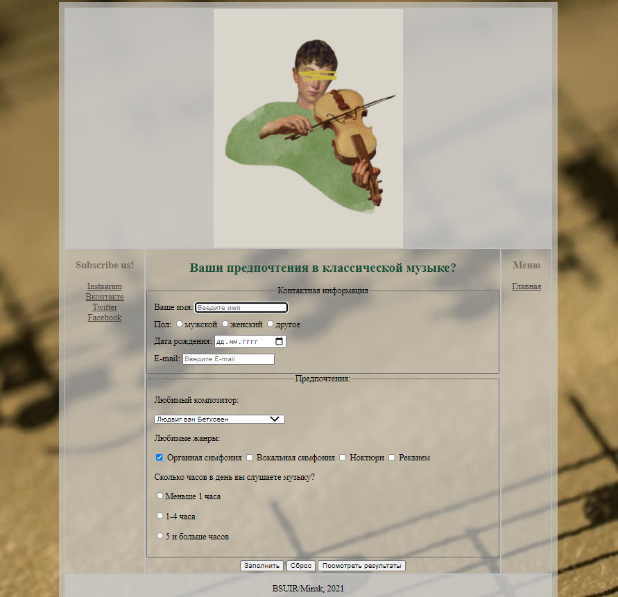
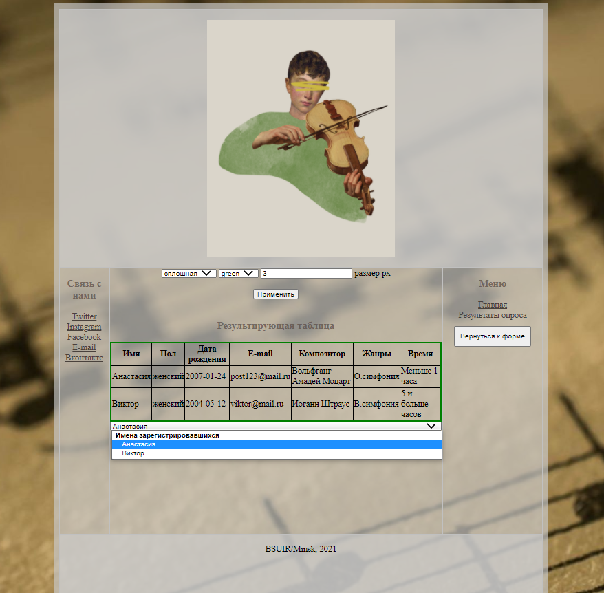

## a survey form for a classical music site
In this project I mastered:
- JavaScript
- HTML, CSS
##### *on the first page you can fill your data for the survey, and on the second page a table with current users and their data is displayed, all information is stored in LocalStorage*
##### first page

##### second page

